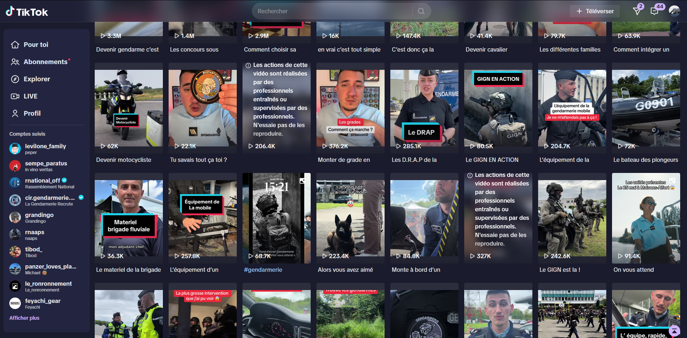
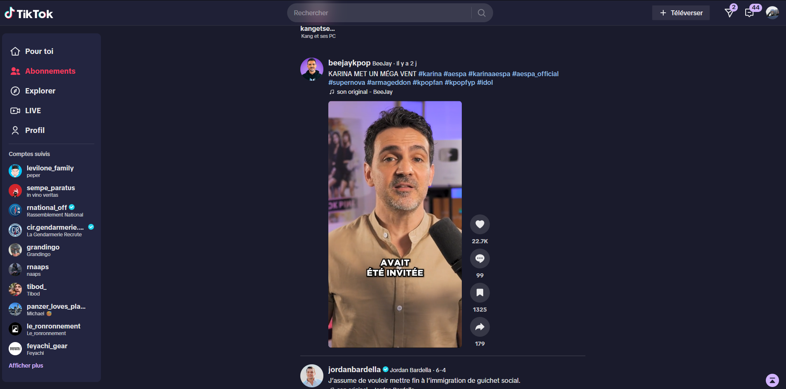
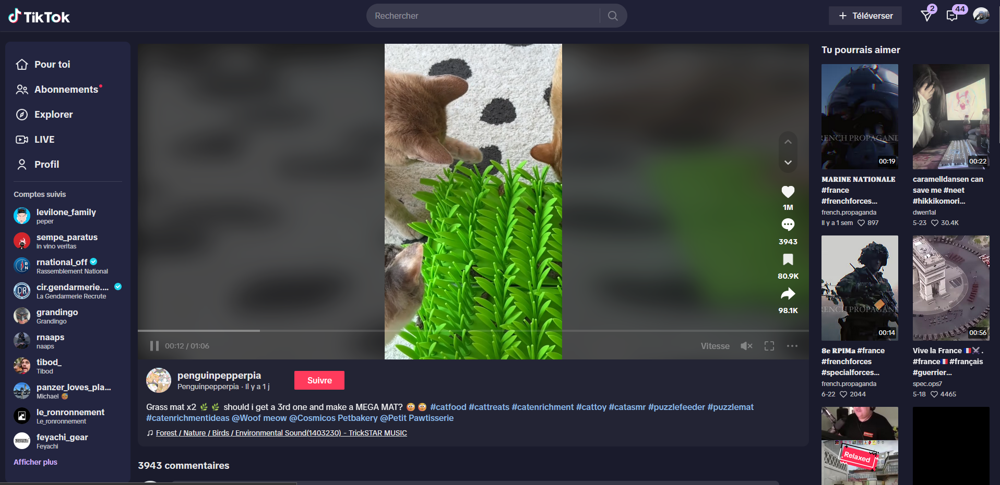

<h3>Doggui Pack</h3>

<h6>
<a href="https://github.com/doggui-pack/">Github</a>
·
<a href=https://github.com/doggui-pack/doggui">Get started</a>
·
<a href="https://github.com/doggui-pack/doggui?tab=readme-ov-file#-palette">Colors</a>
·
<a href="https://github.com/doggui-pack/doggui?tab=readme-ov-file#-application">Application</a>
·
<a href="https://github.com/doggui-pack/doggui?tab=readme-ov-file#%EF%B8%8F-gratitude">Information</a>
</h6>

<em>
Community-based and accessible to all, Doggui lets everyone personalize their interface with elegance.
</em>

## Installation
1. Install Stylus
2. copy and paste ``/doggui.css``

## Preview

